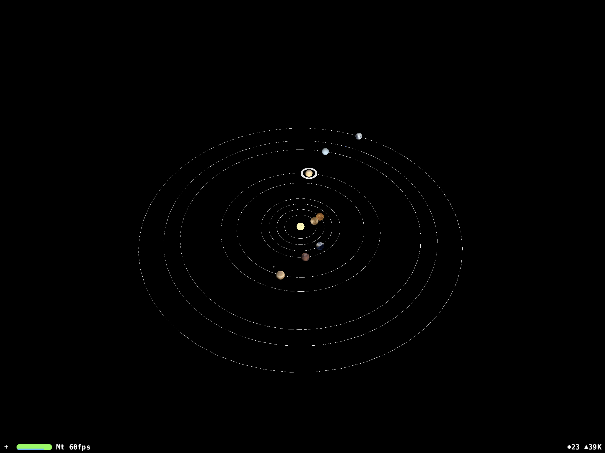
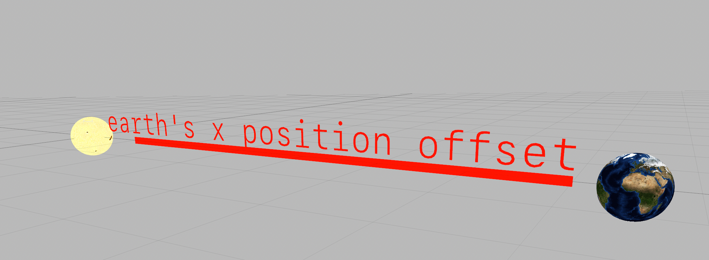

Now accepting beta testers. [Sign up here](https://augmentedsolarsystem.herokuapp.com) 

# Augmented Reality Solar System

This is a fun toy app which explores the capabilities of ARKit. The heavy lifting is done by SceneKit but the possibilities for exploring the world(s) are endless and exciting.

The app can be run either in ARKit with the `SolarSystem` target and requires the user to find an `ARAnchorPlane`:

 It can also be run in a SceneKit View with a black background using the `SolarSystemScene` target:

The ARKit is much more interactive, while the SCNView is much more debuggable.

### Structure

The main data type, called a `Planet` describes the properties of each of the planets in the solar system. This includes the `name`, the planet's `radius`, `axialTilt`, `orbitalRadius`, `orbitalPeriod` and `rotationDuration`. There are static initializers for each of the planets for convenience. A `Planet` implements `Equatable` for easy identification of planet objects in collections.

This app relies heavily on SceneKit. Within the main scene, either in SceneKit or ARKit, all planets (including the sun) are added to the scene with a given `position`. The `x` value of the position ultimately defines the distance the planet is from the Sun. As such, manipulating this parameter allows us to describe a scale version of the Solar System where each `Planet` describes the distance from the Sun. See image below:

### Layers

Earth Layers were found on [Blender Guru](https://www.blenderguru.com/tutorials/create-a-realistic-earth) and they look pretty slick up close.

